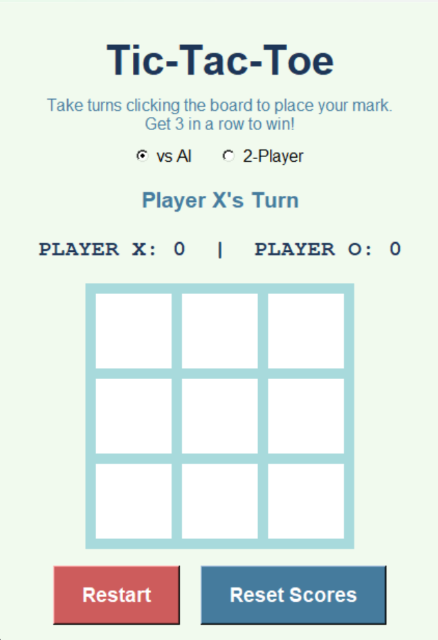

# Tic-Tac-Toe (Python Tkinter)

A modern Tic-Tac-Toe game built using Python and Tkinter, featuring both single-player and two-player modes, intelligent AI, and persistent score tracking.

## Features
- 🎮 Single-player mode (vs AI)
- 👥 Two-player mode
- 🧠 Smart AI (win → block → random strategy)
- 💾 Score saving using file handling
- ⚠️ Error handling for missing or corrupted score files
- 🎨 Modern GUI with dynamic colors and visual feedback

## How to Run
1. Ensure Python is installed
2. Run the program:
   ```bash
   python 37428756.py

   ## Preview

